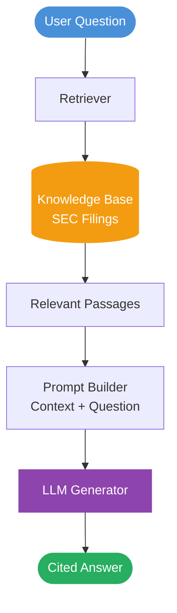
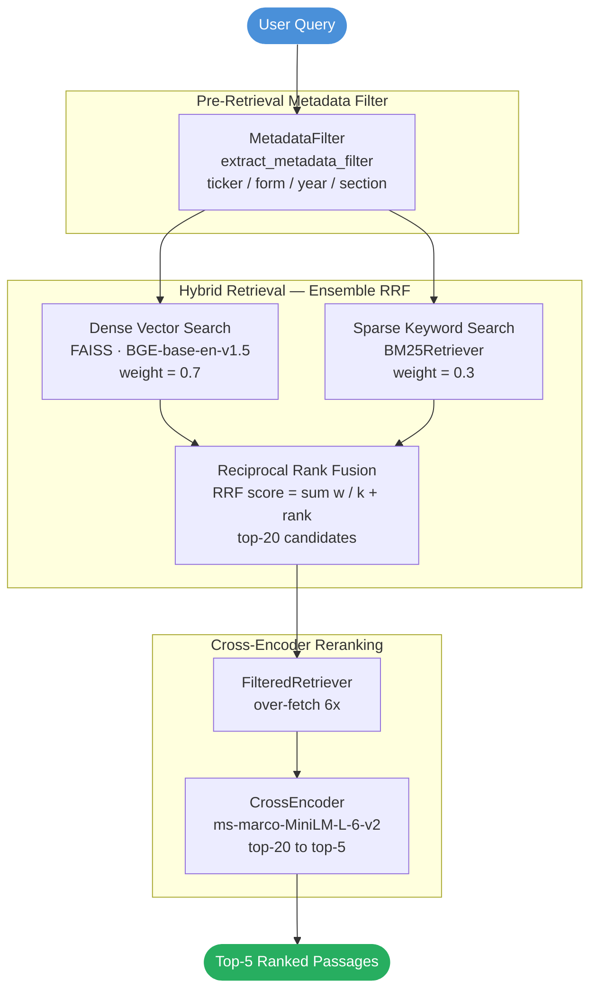
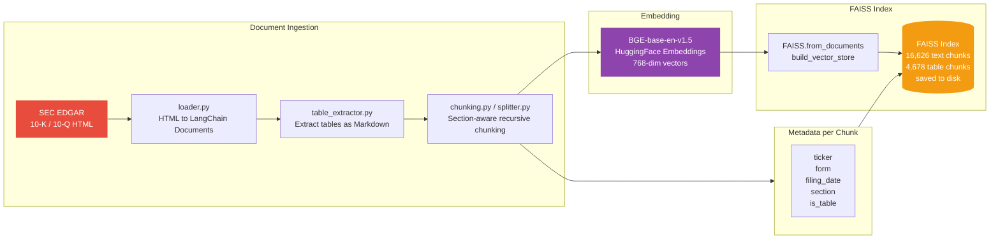
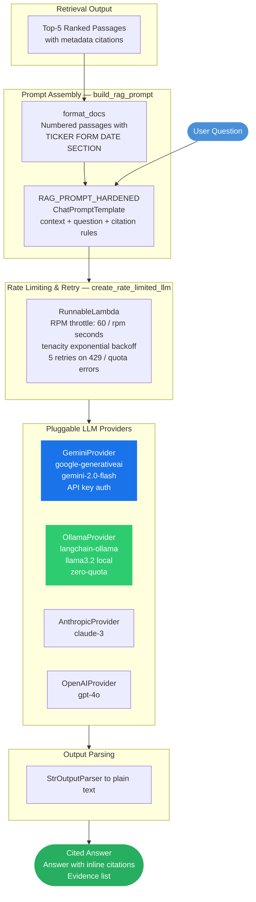
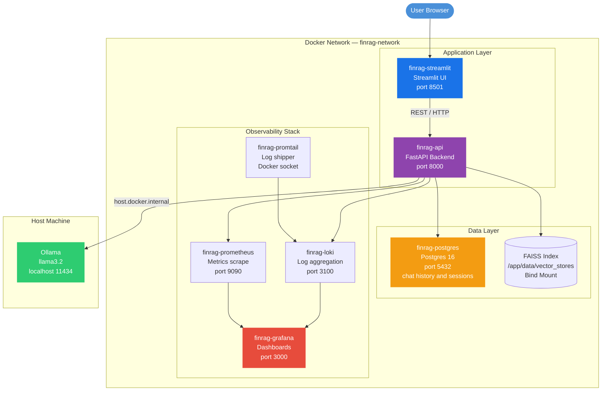

# Financial Intelligence and Evidence Nexus Decisioning (FIEND)

Created as an enterprise-grade Retrieval-Augmented Generation (RAG) system engineered for high-stakes financial document intelligence and forensic regulatory analysis. Built on LangChain, FIEND ingests and processes regulatory corporate disclosures (SEC EDGAR Forms 10-K and 10-Q) to deliver mathematically grounded, citation-backed answers with strict refusal protocols and end-to-end evidence attribution.

## Features

- **SEC EDGAR Ingestion**: Downloads and parses 10-K/10-Q filings from SEC EDGAR
- **Table-Aware Processing**: Extracts and preserves financial tables as Markdown with context headers
- **Section-Aware Chunking**: Respects SEC filing structure (Part I/II, Item 1A, Item 7, etc.)
- **Hybrid Retrieval**: Combines dense (BGE-base) and sparse (BM25) retrieval with RRF
- **Metadata Filtering**: Pre-retrieval filtering by ticker, form, fiscal year, section
- **Cross-Encoder Reranking**: ms-marco-MiniLM-L-6-v2 reranker (top-20 → top-5)
- **Grounded Generation**: Hardened prompt with mandatory citations and refusal handling
- **Pluggable LLM Providers**: Gemini, Anthropic, OpenAI, Ollama (local, zero-quota)

---

## System Diagrams

### 1. Core RAG Model Overview

A high-level view of the Retrieval-Augmented Generation loop — showing the conceptual flow from a user question to a grounded, cited answer, without drilling into sub-components.



---

### 2. Retrieval Pipeline

The multi-stage retrieval pipeline that narrows thousands of chunks down to the top-5 most relevant passages for any given query.



---

### 3. FAISS Vector Store — Embedding & Indexing

How raw SEC filing HTML is transformed into searchable dense-vector embeddings and stored in the FAISS index.



---

### 4. Gemini & Ollama — LLM Generation with Grounded Prompting

How user queries and retrieved passages are assembled into a hardened prompt and dispatched to either the cloud (Gemini) or local (Ollama) LLM provider, with rate-limiting and retry logic.



---

### 5. Full-Stack Deployment Architecture

End-to-end containerised deployment with the FastAPI backend, Streamlit UI, PostgreSQL persistence, and the Prometheus → Loki → Grafana observability stack — all wired through a single Docker network.



---

## Quick Start

```bash
# 1. Install dependencies
pip install -e .

# 2. Set up environment variables
cp .env.example .env
# Edit .env with your API keys

# 3. Download SEC filings
python scripts/run_pipeline.py build

# 4. Query the system
python scripts/run_pipeline.py query "What was Apple's revenue in Q3 2026?"
```

## Configuration

Configure via `.env` file:

```bash
# LLM Provider (gemini, anthropic, openai, ollama)
LLM_PROVIDER=ollama
DEFAULT_LLM_MODEL=llama3.2

# Embedding model
EMBEDDING_PROVIDER=huggingface
DEFAULT_EMBEDDING_MODEL=BAAI/bge-base-en-v1.5

# Vector store
VECTOR_STORE_DIR=data/vector_stores/phase6_table_aware

# Rate limiting
LLM_RPM=10
LLM_TEMPERATURE=0.1
LLM_MAX_TOKENS=4096
```

## Commands

```bash
# Build vector index from SEC filings
python scripts/run_pipeline.py build

# Run test queries
python scripts/run_pipeline.py test

# Interactive query mode
python scripts/run_pipeline.py query

# Single question
python scripts/run_pipeline.py query "What was Apple's revenue in Q3 2026?"
```

## Evaluation

```bash
# Retrieval evaluation (45 questions)
python eval/evaluate_retrieval.py

# Generation evaluation (87 questions)
python eval/evaluate_generation.py --store data/vector_stores/phase6_table_aware --k 5 --fetch 20
```

## Project Structure

```
src/finrag/
├── config.py              # Configuration management
├── data/                  # Document loading & chunking
│   ├── loader.py          # SEC HTML parsing
│   ├── splitter.py        # Recursive chunking
│   ├── chunking.py        # Fixed/recursive/section-aware chunking
│   ├── table_extractor.py # HTML table extraction
│   └── xbrl.py            # XBRL cleanup
├── embeddings/            # Embedding providers
├── vectorstore/           # FAISS operations
├── retrieval/             # Retrieval pipeline
│   ├── __init__.py        # BM25, hybrid, reranking, filtering
│   └── metadata_filter.py # Query-time metadata filtering
├── generation/            # LLM generation
│   └── __init__.py        # Prompts, providers, rate limiting
├── pipeline.py            # FinRAGPipeline class
└── cli.py                 # CLI entry point

eval/
├── evaluate_generation.py # Generation evaluation
├── evaluate_retrieval.py  # Retrieval metrics
├── evaluate_embeddings.py # Embedding comparison
├── evaluate_hybrid.py     # Hybrid retrieval eval
├── evaluate_reranking.py  # Reranker evaluation
├── evaluate_filtering.py  # Metadata filtering eval
├── evaluate_tables.py     # Table extraction eval
├── evaluate_reranking.py  # Reranker evaluation
├── create_eval_set.py     # Eval set creation
└── add_table_questions.py # Table question generation
```

## Architecture

```
SEC EDGAR → HTML Loader → Table Extractor → Section-Aware Chunking
    → BGE-base Embeddings → FAISS Index (16,626 chunks, 4,678 tables)
    → Hybrid Retrieval (Dense 0.7 / BM25 0.3)
    → Metadata Filtering (ticker/form/year/section)
    → Cross-Encoder Reranker (top-20 → top-5)
    → Hardened Prompt + Ollama LLM
```

## Phase 9 Evaluation Results (87 questions)

| Config | Accuracy | Format % | Citation % | Grounded % | Refusal % |
|----------|----------|----------|------------|------------|-----------|
| Hardened + Rerank | 51.7% | 66.7% | 75.9% | 85.1% | 89.7% |
| Hardened + No Rerank | 54.0% | 63.2% | 74.7% | 94.3% | 82.8% |

See `eval/results/phase9_summary.md` for full results.

## Development

```bash
# Run tests
pytest tests/

# Run retrieval evaluation
python eval/evaluate_retrieval.py

# Run generation evaluation
python eval/evaluate_generation.py --store data/vector_stores/phase6_table_aware --k 5 --fetch 20
```

## Requirements

- Python 3.10+
- Ollama (for local LLM) or API keys for cloud providers
- ~4GB RAM for embeddings + FAISS index
- ~2GB disk for SEC filings + vector store

## License

MIT License - see LICENSE file for details.