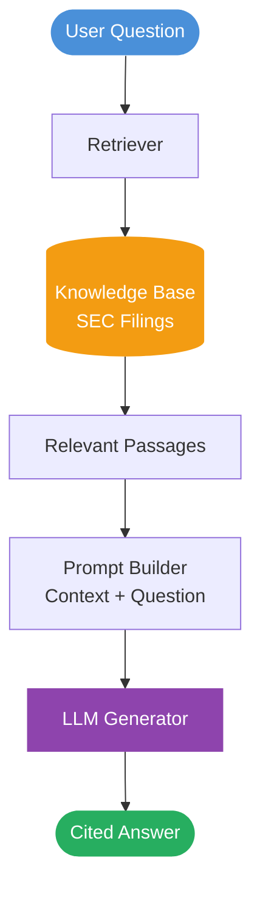
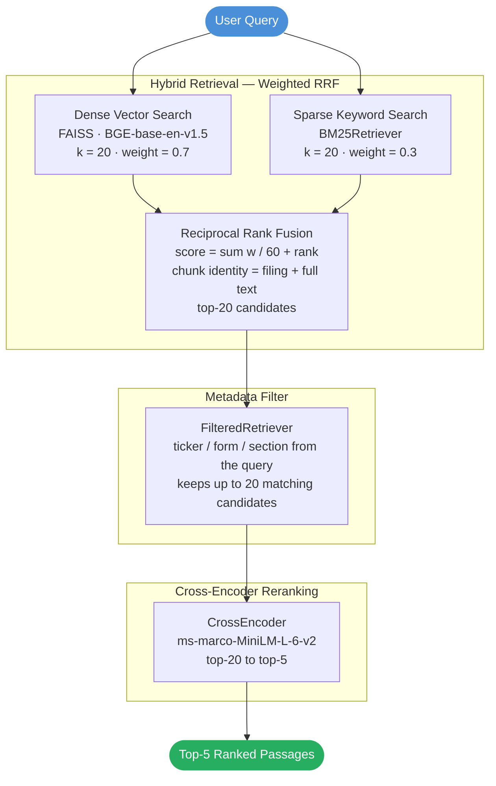
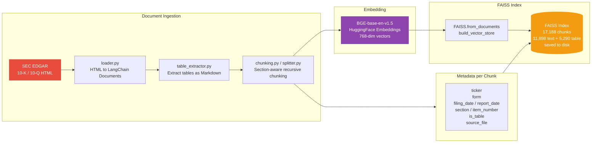
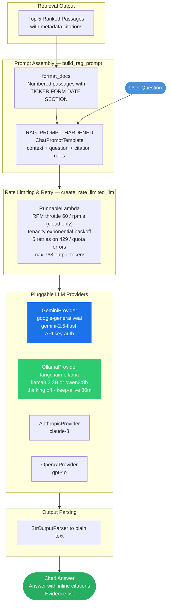
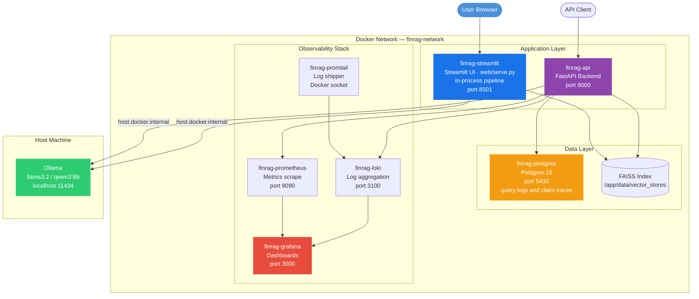

# Financial Intelligence and Evidence Nexus Decisioning (FIEND)

Created as an enterprise-grade Retrieval-Augmented Generation (RAG) system engineered for high-stakes financial document intelligence and forensic regulatory analysis. Built on LangChain, FIEND ingests and processes regulatory corporate disclosures (SEC EDGAR Forms 10-K and 10-Q) to deliver mathematically grounded, citation-backed answers with strict refusal protocols and end-to-end evidence attribution.

## Features

- **SEC EDGAR Corpus**: Parses 30 10-K/10-Q filings (15 companies, latest 10-K + 10-Q each) listed in `data/manifest.json`
- **Table-Aware Processing**: Extracts and preserves financial tables as Markdown with context headers
- **Section-Aware Chunking**: Respects SEC filing structure (Part I/II, Item 1A, Item 7, etc.)
- **Hybrid Retrieval**: Combines dense (BGE-base) and sparse (BM25) retrieval with weighted RRF
- **Metadata Filtering**: Query-derived filtering by ticker, form and section (fiscal-year filtering is currently disabled — chunks carry no fiscal year)
- **Cross-Encoder Reranking**: ms-marco-MiniLM-L-6-v2 reranker (top-20 → top-5)
- **Grounded Generation**: Hardened prompt with mandatory citations and refusal handling
- **Pluggable LLM Providers**: Gemini, Anthropic, OpenAI, Ollama (local: llama3.2 3B or qwen3:8b, switchable in the UI)
- **Explainability**: Per-claim citation verification with dense / BM25 / RRF / rerank scores per evidence chunk
- **Full Stack**: Streamlit UI, FastAPI service, Postgres query logging, Prometheus + Loki + Grafana

---

## System Diagrams

### 1. Core RAG Model Overview

A high-level view of the Retrieval-Augmented Generation loop — showing the conceptual flow from a user question to a grounded, cited answer, without drilling into sub-components.


```mermaid
flowchart TD
    A([User Question]) --> B[Retriever]
    B --> C[(Knowledge Base\nSEC Filings)]
    C --> D[Relevant Passages]
    D --> E[Prompt Builder\nContext + Question]
    E --> F[LLM Generator]
    F --> G([Cited Answer])

    style A fill:#4A90D9,color:#fff,stroke:none
    style G fill:#27AE60,color:#fff,stroke:none
    style C fill:#F39C12,color:#fff,stroke:none
    style F fill:#8E44AD,color:#fff,stroke:none
```

---

### 2. Retrieval Pipeline

The multi-stage retrieval pipeline that narrows 17,188 chunks down to the top-5 most relevant passages for any given query. BM25, the reranker and the embedding model are loaded once at startup and reused for every query.


```mermaid
flowchart TD
    Q([User Query]) --> DENSE
    Q --> BM25

    subgraph HYBRID["Hybrid Retrieval — Weighted RRF"]
        DENSE["Dense Vector Search\nFAISS · BGE-base-en-v1.5\nk = 20 · weight = 0.7"]
        BM25["Sparse Keyword Search\nBM25Retriever\nk = 20 · weight = 0.3"]
        RRF["Reciprocal Rank Fusion\nscore = sum w / 60 + rank\nchunk identity = filing + full text\ntop-20 candidates"]
        DENSE --> RRF
        BM25 --> RRF
    end

    RRF --> FR

    subgraph FILTER["Metadata Filter"]
        FR["FilteredRetriever\nticker / form / section from the query\nkeeps up to 20 matching candidates"]
    end

    FR --> CE

    subgraph RERANK["Cross-Encoder Reranking"]
        CE["CrossEncoder\nms-marco-MiniLM-L-6-v2\ntop-20 to top-5"]
    end

    CE --> R([Top-5 Ranked Passages])

    style Q fill:#4A90D9,color:#fff,stroke:none
    style R fill:#27AE60,color:#fff,stroke:none
```

---

### 3. FAISS Vector Store — Embedding & Indexing

How raw SEC filing HTML is transformed into searchable dense-vector embeddings and stored in the FAISS index.


```mermaid
flowchart LR
    subgraph INGEST["Document Ingestion"]
        A["SEC EDGAR\n10-K / 10-Q HTML"] --> B["loader.py\nHTML to LangChain Documents"]
        B --> C["table_extractor.py\nExtract tables as Markdown"]
        C --> D["chunking.py / splitter.py\nSection-aware recursive chunking"]
    end

    subgraph EMBED["Embedding"]
        D --> E["BGE-base-en-v1.5\nHuggingFace Embeddings\n768-dim vectors"]
    end

    subgraph STORE["FAISS Index"]
        E --> F["FAISS.from_documents\nbuild_vector_store"]
        F --> G[("FAISS Index\n17,188 chunks\n11,898 text + 5,290 table\nsaved to disk")]
    end

    subgraph META["Metadata per Chunk"]
        H["ticker\nform\nfiling_date / report_date\nsection / item_number\nis_table\nsource_file"]
    end

    D --> META
    META --> G

    style A fill:#E74C3C,color:#fff,stroke:none
    style G fill:#F39C12,color:#fff,stroke:none
    style E fill:#8E44AD,color:#fff,stroke:none
```

---

### 4. Gemini & Ollama — LLM Generation with Grounded Prompting

How user queries and retrieved passages are assembled into a hardened prompt and dispatched to either a cloud provider or local Ollama. Cloud providers are rate-limited; local Ollama is not.


```mermaid
flowchart TD
    subgraph RETRIEVAL["Retrieval Output"]
        P["Top-5 Ranked Passages\nwith metadata citations"]
    end

    subgraph PROMPT["Prompt Assembly — build_rag_prompt"]
        FD["format_docs\nNumbered passages with\nTICKER FORM DATE SECTION"]
        PT["RAG_PROMPT_HARDENED\nChatPromptTemplate\ncontext + question + citation rules"]
        FD --> PT
    end

    P --> FD
    Q([User Question]) --> PT

    subgraph PROVIDERS["Pluggable LLM Providers"]
        direction LR
        GEM["GeminiProvider\ngoogle-generativeai\ngemini-2.5-flash\nAPI key auth"]
        OLL["OllamaProvider\nlangchain-ollama\nllama3.2 3B or qwen3:8b\nthinking off · keep-alive 30m"]
        ANT["AnthropicProvider\nclaude-3"]
        OAI["OpenAIProvider\ngpt-4o"]
    end

    subgraph RATELIMIT["Rate Limiting & Retry — create_rate_limited_llm"]
        RL["RunnableLambda\nRPM throttle 60 / rpm s (cloud only)\ntenacity exponential backoff\n5 retries on 429 / quota errors\nmax 768 output tokens"]
    end

    PT --> RATELIMIT
    RATELIMIT --> PROVIDERS

    PROVIDERS --> OUT

    subgraph OUT["Output Parsing"]
        SP["StrOutputParser to plain text"]
    end

    OUT --> A([Cited Answer\nAnswer with inline citations\nEvidence list])

    style Q fill:#4A90D9,color:#fff,stroke:none
    style GEM fill:#1A73E8,color:#fff,stroke:none
    style OLL fill:#2ECC71,color:#fff,stroke:none
    style A fill:#27AE60,color:#fff,stroke:none
```

---

### 5. Full-Stack Deployment Architecture

End-to-end containerised deployment with the FastAPI backend, Streamlit UI, PostgreSQL persistence, and the Prometheus → Loki → Grafana observability stack — all wired through a single Docker network. The Streamlit UI and the API each load their own copy of the pipeline at startup (~0.8 GB RAM each); the UI does not call the API.


```mermaid
flowchart TD
    USER(["User Browser"]) --> UI
    CLIENT(["API Client"]) --> API

    subgraph DOCKER["Docker Network — finrag-network"]

        subgraph APP["Application Layer"]
            UI["finrag-streamlit\nStreamlit UI · web/serve.py\nin-process pipeline\nport 8501"]
            API["finrag-api\nFastAPI Backend\nport 8000"]
        end

        subgraph DATA["Data Layer"]
            PG["finrag-postgres\nPostgres 16\nport 5432\nquery logs and claim traces"]
            FS[("FAISS Index\n/app/data/vector_stores")]
        end

        UI --> FS

        subgraph OBS["Observability Stack"]
            PROM["finrag-prometheus\nMetrics scrape\nport 9090"]
            LOKI["finrag-loki\nLog aggregation\nport 3100"]
            PT2["finrag-promtail\nLog shipper\nDocker socket"]
            GRAF["finrag-grafana\nDashboards\nport 3000"]
            PT2 --> LOKI
            PROM --> GRAF
            LOKI --> GRAF
        end

        API --> PG
        API --> FS
        API --> PROM
        API --> LOKI
    end

    subgraph HOST["Host Machine"]
        OLL_HOST["Ollama\nllama3.2 / qwen3:8b\nlocalhost 11434"]
    end

    API -- "host.docker.internal" --> OLL_HOST
    UI -- "host.docker.internal" --> OLL_HOST

    style USER fill:#4A90D9,color:#fff,stroke:none
    style OLL_HOST fill:#2ECC71,color:#fff,stroke:none
    style PG fill:#F39C12,color:#fff,stroke:none
    style GRAF fill:#E74C3C,color:#fff,stroke:none
    style API fill:#8E44AD,color:#fff,stroke:none
    style UI fill:#1A73E8,color:#fff,stroke:none
```

---

## Quick Start

```bash
# 1. Install dependencies
pip install -e .

# 2. Set up environment variables
cp .env.example .env
# Edit .env (LLM provider, model, API keys if using a cloud provider)

# 3. Provide the data
# The filings listed in data/manifest.json must be present under data/raw/ and the
# production index under data/vector_stores/phase6_table_aware/ (both gitignored).
# The EDGAR downloader is not part of this repository.

# 4. Pull the local models (if LLM_PROVIDER=ollama)
ollama pull llama3.2
ollama pull qwen3:8b

# 5. Start the web UI (loads the pipeline at server start, ~30s)
streamlit run web/serve.py

# or the REST API
uvicorn finrag.api.main:app --port 8000

# or the full stack (UI, API, Postgres, Prometheus, Loki, Grafana)
docker compose up
```

## Configuration

Configure via `.env` file:

```bash
# LLM Provider (gemini, anthropic, openai, ollama)
LLM_PROVIDER=ollama
DEFAULT_LLM_MODEL=llama3.2          # or qwen3:8b

# Embedding model
EMBEDDING_PROVIDER=huggingface
DEFAULT_EMBEDDING_MODEL=BAAI/bge-base-en-v1.5

# Vector store
VECTOR_STORE_DIR=data/vector_stores/phase6_table_aware

# Generation
LLM_TEMPERATURE=0.1
LLM_MAX_TOKENS=768                  # longest eval answer ~460 tokens; fits Ollama's 4,096 context
LLM_RPM=10                          # throttles cloud providers only; Ollama is never throttled

# Ollama
OLLAMA_KEEP_ALIVE=30m               # keep models loaded between queries
OLLAMA_REASONING=false              # qwen3 hidden "thinking" (~6x slower) off by default
```

The UI theme lives in `.streamlit/config.toml`.

## Commands

> **Warning:** `scripts/run_pipeline.py` drives the legacy *baseline* pipeline (dense only, no tables, no reranker). `build` saves a text-only index into `VECTOR_STORE_DIR`, which defaults to the production `phase6_table_aware` index — point `VECTOR_STORE_DIR` elsewhere before running it.

```bash
# Build the baseline vector index (see warning above)
python scripts/run_pipeline.py build

# Run test queries / interactive mode / single question (baseline pipeline)
python scripts/run_pipeline.py test
python scripts/run_pipeline.py query
python scripts/run_pipeline.py query "What was Apple's revenue in Q3 2026?"

# Inspect the explainability trace for a question (production pipeline)
python scripts/inspect_trace.py inspect "What was Apple's total net sales in fiscal 2025?"
```

## Evaluation

```bash
# Retrieval evaluation (eval/eval_set.json, 45 questions)
python eval/evaluate_retrieval.py

# Generation evaluation (eval/phase9_eval_set.json, 87 questions); model from DEFAULT_LLM_MODEL
python eval/evaluate_generation.py --store data/vector_stores/phase6_table_aware --k 5 --fetch 20
```

## Project Structure

```
src/finrag/
├── config.py              # Configuration management
├── data/                  # Document loading & chunking
│   ├── loader.py          # SEC HTML parsing
│   ├── splitter.py        # Recursive chunking
│   ├── chunking.py        # Fixed/recursive/section-aware chunking
│   ├── table_extractor.py # HTML table extraction
│   ├── sec_headings.py    # SEC section heading detection
│   └── xbrl.py            # XBRL cleanup
├── embeddings/            # Embedding providers
├── vectorstore/           # FAISS operations
├── retrieval/             # Retrieval pipeline
│   ├── __init__.py        # BM25, hybrid RRF, reranking, filtering
│   └── metadata_filter.py # Query-time metadata filtering
├── generation/            # LLM generation
│   └── __init__.py        # Prompts, providers, rate limiting
├── explainability/        # Claim tracing and per-stage retrieval scores
├── api/main.py            # FastAPI service
├── persistence/           # Postgres query logging
├── monitoring/            # Prometheus metrics
└── pipeline.py            # FinRAGPipeline class

web/
├── serve.py               # Streamlit entry point (preloads the pipeline)
├── resources.py           # Shared cached pipeline loader
└── app.py                 # Streamlit UI

eval/
├── evaluate_generation.py # Generation evaluation
├── evaluate_retrieval.py  # Retrieval metrics
├── evaluate_embeddings.py # Embedding comparison
├── evaluate_hybrid.py     # Hybrid retrieval eval
├── evaluate_reranking.py  # Reranker evaluation
├── evaluate_filtering.py  # Metadata filtering eval
├── evaluate_tables.py     # Table extraction eval
├── create_eval_set.py     # Eval set creation
└── add_table_questions.py # Table question generation

knowledge-graph/           # Project knowledge graph (build status, decisions, open issues)
```

## Architecture

```
SEC EDGAR filings (data/raw) → HTML Loader → Table Extractor → Section-Aware Chunking
    → BGE-base Embeddings → FAISS Index (17,188 chunks: 11,898 text + 5,290 table)
    → Hybrid Retrieval (Dense 0.7 / BM25 0.3, top-20)
    → Metadata Filtering (ticker/form/section)
    → Cross-Encoder Reranker (top-20 → top-5)
    → Hardened Prompt + Ollama LLM (llama3.2 or qwen3:8b)
```

## Evaluation Results (87 questions, 2026-10-08)

Strict scoring: a refusal on an answerable question counts as wrong. Single runs; expect a few questions of run-to-run variation.

| Model | Accuracy | Format % | Citation % | Grounded % | Refusal % | Avg latency |
|-------|----------|----------|------------|------------|-----------|-------------|
| llama3.2 (3B) | 82.8% | 79.3% | 74.7% | 98.9% | 90.8% | 1.3s |
| qwen3:8b (thinking off) | 79.3% | 98.9% | 98.9% | 96.6% | 81.6% | 3.0s |

Latency is LLM generation only; a full query in the web UI takes ~1.5–2s with llama3.2. Earlier figures are superseded: the original Phase 9 result (51.7%) predates the October prompt and evaluator fixes, qwen3:8b's "92%" was an evaluator bug that scored some refusals as correct, and runs between 2026-09-06 and 2026-10-08 reranked only 5 candidates. See `decisions_log` in `knowledge-graph/knowledge-graph.json` for the history.

## Development

```bash
# Run tests (excluding the two production-pipeline tests)
pytest tests/ -k "not ProductionPipeline"

# Run retrieval evaluation
python eval/evaluate_retrieval.py

# Run generation evaluation
python eval/evaluate_generation.py --store data/vector_stores/phase6_table_aware --k 5 --fetch 20
```

`test_build_production_pipeline` re-embeds the whole corpus and writes into the production index directory — run it only deliberately. Five tests currently fail for known reasons (stale tests after intentional code changes); see `test_status` in the knowledge graph.

## Requirements

- Python 3.10+ (Docker image: 3.11)
- Streamlit 1.63+ (for `web/serve.py`)
- Ollama (for local LLMs) or API keys for cloud providers
- ~1 GB RAM per process that loads the pipeline (UI and API each load one)
- GPU with 8 GB VRAM fits one local model at a time (llama3.2 2.4 GB, qwen3:8b 5.2 GB)
- ~2GB disk for SEC filings + vector store

## License

MIT License - see LICENSE file for details.